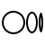
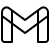

<h1 align="center"> Hello Internet   
Im Aryan Kathawale
</h1>
 

<strong>you are Currently on My Github Profile</strong>
 
Directly connect with me here :  

&nbsp;

&nbsp; 

&nbsp; 

<h1> About Me 
</h1>
im a <b>Fullstack Developer 👨‍💻</b> With priority to MERN stack .  I ❤️ Contributing to open source and take part in  online events including .   <b>Google Developers Students Club</b> , <b>MLH</b>, <b>Github Students</b> , <b>EddieHub</b>  and many more  i love collaborating with people and work on cool projects  
my future goal is to work @ <b>Nasa</b> as an SWE .   because i love all things space related 🚀🧑‍🚀 . im open to Work on any new technologies that appear on the <b>Internet</b>

